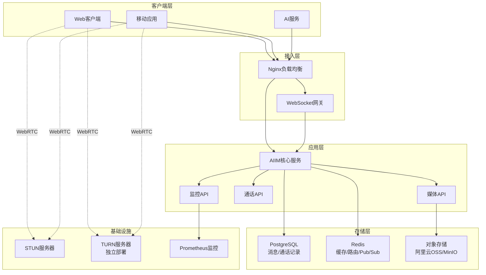

# AIIM技术方案 v2.0 (2025年版)

*基于音视频功能扩展的全面升级*

---

## 1. 核心功能

### 1.1 基础IM功能
* ✅ 支持 1:1 私聊（文字、图片 URL、文件 URL）
* ✅ 消息实时发送与接收（低延迟）
* ✅ 消息顺序保证（会话内有序）
* ✅ 消息送达回执（sent / delivered / read）
* ✅ 断线重连与消息补偿
* ✅ 多终端消息同步
* ✅ 企业级安全（JWT 鉴权、传输加密、防刷机制）
* ✅ 支持 AI 服务作为对话一方，包含流式消息推送

### 1.2 音视频功能 (NEW)
* ✅ **异步语音消息**：音频文件上传、存储、播放
* ✅ **H2H实时通话**：WebRTC音视频通话
* ✅ **通话管理**：发起、接受、拒绝、挂断
* ✅ **媒体存储**：对象存储集成（支持MinIO/阿里云OSS）
* ✅ **STUN/TURN支持**：NAT穿越和P2P连接

### 1.3 企业级特性 (NEW)
* ✅ **监控系统**：Prometheus指标、健康检查
* ✅ **性能优化**：连接池、缓存、异步处理
* ✅ **安全加固**：多层认证、内容验证、审计日志
* ✅ **可扩展架构**：微服务、负载均衡、容器化

---

## 2. 系统架构



---

## 3. 技术栈升级

| 功能分层 | 技术方案 | 版本 | 说明 |
|---------|----------|------|------|
| **Web框架** | FastAPI | 0.111.0 | 高性能异步API框架 |
| **WSGI服务器** | Gunicorn + Uvicorn | 21.2.0 + 0.30.0 | 生产级ASGI服务器 |
| **数据库** | PostgreSQL | 15+ | 主数据存储，支持JSONB |
| **缓存/消息** | Redis | 7+ | 缓存、Pub/Sub、序列号生成 |
| **对象存储** | 阿里云OSS / MinIO | - | 媒体文件存储 |
| **WebRTC** | coturn (TURN) | latest | NAT穿越服务器 |
| **监控** | Prometheus | 0.20.0 | 指标收集和监控 |
| **容器化** | Docker + Compose | - | 容器化部署 |
| **负载均衡** | Nginx | alpine | 反向代理和SSL终止 |
| **认证** | JWT + API Key | - | 多层认证机制 |

---

## 4. 数据模型升级

### 4.1 消息类型扩展

```python
class MessageType(Enum):
    text = "text"           # 文本消息
    image = "image"         # 图片消息  
    file = "file"           # 文件消息
    audio = "audio"         # 音频消息 (NEW)
    video = "video"         # 视频消息 (NEW)
    system = "system"       # 系统消息
    ai = "ai"              # AI消息
    stream_chunk = "stream_chunk"  # 流式消息片段
```

### 4.2 数据库表结构

```sql
-- 会话表
CREATE TABLE conversations (
    conversation_id VARCHAR(128) PRIMARY KEY,
    type VARCHAR(16) NOT NULL DEFAULT 'direct', -- direct, group
    name VARCHAR(256),
    tenant_id VARCHAR(64),
    created_at TIMESTAMP DEFAULT CURRENT_TIMESTAMP,
    updated_at TIMESTAMP DEFAULT CURRENT_TIMESTAMP,
    last_seq BIGINT DEFAULT 0
);

-- 会话成员表 (NEW)
CREATE TABLE conversation_members (
    conversation_id VARCHAR(128) NOT NULL,
    user_id VARCHAR(64) NOT NULL,
    role VARCHAR(16) DEFAULT 'member', -- member, admin
    joined_at TIMESTAMP DEFAULT CURRENT_TIMESTAMP,
    PRIMARY KEY (conversation_id, user_id)
);

-- 消息表 (扩展)
CREATE TABLE im_messages (
    message_id VARCHAR(128) PRIMARY KEY,
    conversation_id VARCHAR(128) NOT NULL,
    sender_id VARCHAR(64) NOT NULL,
    type VARCHAR(16) NOT NULL, -- 支持audio/video
    content JSONB NOT NULL,
    reply_to VARCHAR(128),
    client_msg_id VARCHAR(128),
    created_at TIMESTAMP DEFAULT CURRENT_TIMESTAMP,
    seq BIGINT,
    edited_at TIMESTAMP,
    status VARCHAR(16) DEFAULT 'sent',
    tenant_id VARCHAR(64),
    -- 流式消息字段
    stream_id VARCHAR(128),
    chunk_index INTEGER,
    is_end BOOLEAN DEFAULT FALSE
);

-- 通话记录表 (NEW)
CREATE TABLE call_logs (
    call_id VARCHAR(128) PRIMARY KEY,
    conversation_id VARCHAR(128) NOT NULL,
    initiator_id VARCHAR(64) NOT NULL,
    call_type VARCHAR(16) DEFAULT 'audio', -- audio, video
    status VARCHAR(16) DEFAULT 'initiated',
    started_at TIMESTAMP,
    ended_at TIMESTAMP,
    duration INTEGER, -- 秒
    end_reason VARCHAR(32),
    created_at TIMESTAMP DEFAULT CURRENT_TIMESTAMP
);

-- 消息回执表 (NEW)
CREATE TABLE message_receipts (
    message_id VARCHAR(128) NOT NULL,
    user_id VARCHAR(64) NOT NULL,
    status VARCHAR(16) NOT NULL, -- delivered, read
    timestamp TIMESTAMP DEFAULT CURRENT_TIMESTAMP,
    PRIMARY KEY (message_id, user_id, status)
);
```

---

## 5. API接口规范

### 5.1 REST API

```
# 核心IM功能
POST   /api/aiim/conversations     # 创建会话
GET    /api/aiim/conversations     # 获取会话列表
POST   /api/aiim/messages          # 发送消息
GET    /api/aiim/messages/{conv_id} # 获取消息历史

# 媒体功能 (NEW)
POST   /api/aiim/media/upload_token    # 获取上传令牌
POST   /api/aiim/media/upload_complete # 完成上传
GET    /api/aiim/media/{media_id}/download # 下载媒体
GET    /api/aiim/media/{media_id}/metadata # 获取元数据

# 通话功能 (NEW)
POST   /api/aiim/calls/initiate    # 发起通话
POST   /api/aiim/calls/{call_id}/accept  # 接受通话
POST   /api/aiim/calls/{call_id}/reject  # 拒绝通话
POST   /api/aiim/calls/{call_id}/hangup  # 挂断通话
GET    /api/aiim/calls/ice-configuration # 获取ICE配置

# 系统功能
GET    /health      # 健康检查
GET    /healthz     # 简单健康检查
GET    /ready       # 就绪检查
GET    /metrics     # Prometheus指标
```

### 5.2 WebSocket协议

```json
// 消息发送
{
    "type": "send_message",
    "data": {
        "conversation_id": "conv_123",
        "type": "audio",
        "content": {
            "media_id": "audio_456",
            "duration": 30.5,
            "file_size": 1024000
        }
    }
}

// 通话信令 (NEW)
{
    "type": "call.initiate",
    "data": {
        "conversation_id": "conv_123",
        "call_type": "video"
    }
}

// WebRTC信令 (NEW)
{
    "type": "call.webrtc.signal", 
    "data": {
        "call_id": "call_123",
        "signal_type": "offer",
        "signal_data": { /* SDP数据 */ }
    }
}
```

---

## 6. 安全架构升级

### 6.1 多层认证
* **JWT Token**: 用户身份认证
* **API Key**: 服务间调用认证  
* **Request Signature**: Webhook签名验证
* **Content Validation**: 文件内容安全检查

### 6.2 安全中间件
```python
# 安全头中间件
- X-Content-Type-Options: nosniff
- X-Frame-Options: DENY  
- X-XSS-Protection: 1; mode=block
- Strict-Transport-Security: max-age=31536000

# 速率限制
- 每秒请求限制
- IP白名单/黑名单
- 防暴力破解
```

---

## 7. 监控和运维

### 7.1 监控指标
```
# 业务指标
aiim_http_requests_total          # HTTP请求总数
aiim_websocket_connections_active # 活跃WebSocket连接
aiim_messages_total              # 消息总数
aiim_calls_total                 # 通话总数

# 系统指标  
aiim_system_cpu_usage_percent    # CPU使用率
aiim_system_memory_usage_percent # 内存使用率
aiim_db_query_duration_seconds   # 数据库查询耗时
```

### 7.2 健康检查
```json
{
    "status": "healthy",
    "timestamp": 1755659320.8382652,
    "checks": {
        "database": {
            "status": "healthy",
            "response_time": 0.001
        },
        "redis": {
            "status": "healthy", 
            "response_time": 0.002
        },
        "system": {
            "cpu_usage": 25.5,
            "memory_usage": 60.3,
            "status": "healthy"
        }
    },
    "version": "2.0.0"
}
```

---

## 8. 部署架构

### 8.1 推荐生产架构

```
阿里云VPC环境:
├── ECS-1 (主应用服务器 4C8G)
│   ├── AIIM应用 (Docker)
│   ├── Nginx (负载均衡)
│   ├── PostgreSQL (主数据库)
│   └── Redis (缓存+Pub/Sub)
├── ECS-2 (TURN服务器 2C4G)
│   └── coturn (WebRTC NAT穿越)
└── 阿里云OSS (媒体存储)
    └── aiim-media-bucket
```

### 8.2 容器化部署
```yaml
# docker-compose.prod.yml
services:
  postgres: { image: postgres:15-alpine }
  redis: { image: redis:7-alpine }
  aiim: { build: Dockerfile.prod }
  nginx: { image: nginx:alpine }
```

---

## 9. 开发和测试

### 9.1 质量保证
* ✅ **单元测试**: 核心业务逻辑测试
* ✅ **集成测试**: API和WebSocket测试  
* ✅ **功能验证**: 自动化验证脚本
* ✅ **性能测试**: 并发连接和消息处理
* ✅ **安全测试**: 认证、授权、防攻击

### 9.2 开发工具
* `validate_features.py` - 功能验证脚本
* `API_TEST_GUIDE.md` - API测试指南
* `scripts/deploy.sh` - 自动化部署脚本
* Postman Collection - API测试集合

---

## 10. 版本变更记录

### v2.0 (2025年) - 音视频功能扩展
* ✅ 新增异步语音消息功能
* ✅ 新增H2H实时音视频通话
* ✅ 新增媒体存储和处理
* ✅ 新增WebRTC信令服务器
* ✅ 新增企业级监控系统
* ✅ 新增多层安全认证
* ✅ 新增生产级部署配置
* ✅ 重构数据模型支持扩展

### v1.0 (原版) - 基础IM功能
* 基础文本消息功能
* WebSocket实时通信
* 简单JWT认证
* PostgreSQL + Redis存储
* 基础Docker配置

---

## 11. 下一步规划

### 短期目标 (3个月)
* [ ] 群组通话支持 (多人音视频)
* [ ] 消息加密 (端到端加密)
* [ ] 文件预览 (图片、文档)
* [ ] 消息搜索功能

### 中期目标 (6个月)  
* [ ] 多租户完整隔离
* [ ] AI语音助手集成
* [ ] 移动端推送通知
* [ ] 高可用集群部署

### 长期目标 (12个月)
* [ ] 国际化多语言支持
* [ ] 企业级管理后台
* [ ] 开放API和SDK
* [ ] 微服务架构重构

---

**总结**: AIIM v2.0 已从基础IM平台升级为企业级音视频通信解决方案，具备生产环境部署能力和完整的监控、安全、扩展性支持。
